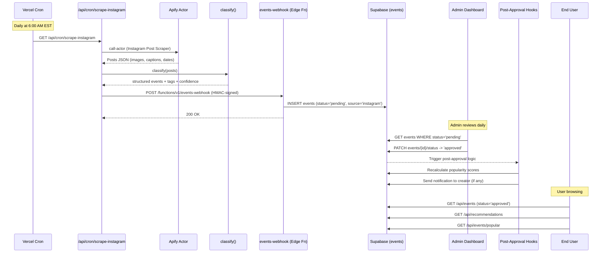

# End-to-End Integration Pipeline

**Status:** Proposal
**Date:** 2026-02-22
**Author:** Integration & Pipeline Agent

---

## 1. Architecture Overview

### 1.1 End-to-End Flow

```
                             UNI-VERSE EVENT PIPELINE
                             ========================

  +-----------+     +-------------+     +--------------+     +----------+
  |  SOURCES  | --> |  INGESTION  | --> | STAGING      | --> |  ADMIN   |
  +-----------+     +-------------+     +--------------+     +----------+
  | Instagram |     | Apify Actor |     | events table |     | /admin/  |
  | (clubs)   |     | run via API |     | status =     |     | pending  |
  |           |     +------+------+     | 'pending'    |     | queue    |
  | Manual    |            |            |              |     +----+-----+
  | submit    |     +------v------+     | + source col |          |
  | /create   |     | Classify    |     | + confidence |     APPROVE
  +-----------+     | (tag/parse) |     | + raw_data   |     or REJECT
                    +------+------+     +--------------+          |
                           |                                      v
                    +------v------+                        +------+------+
                    | Webhook     |                        |  events     |
                    | POST to     |                        |  status =   |
                    | /functions/ |                        | 'approved'  |
                    | v1/events-  |                        +------+------+
                    | webhook     |                               |
                    +-------------+                               v
                                                          +------+------+
                                                          |   POST-     |
                                                          |   APPROVAL  |
                                                          |   HOOKS     |
                                                          +------+------+
                                                          | Popularity  |
                                                          | recalc      |
                                                          | Recommend.  |
                                                          | sync (opt.) |
                                                          +-------------+

  SCHEDULED JOBS (Vercel Cron):
  +-------------------------------------------------------------+
  | Every day 6AM EST:  /api/cron/scrape-instagram               |
  | Every 6 hours:      /api/cron/calculate-popularity           |
  | Every day midnight: /api/cron/cleanup-expired                |
  +-------------------------------------------------------------+
```

### 1.2 Sequence Diagram (Mermaid)



---

## 2. Gap Analysis

### 2.1 Gap Summary Table

| # | Gap | Severity | Current State | Required State | Files to Change/Create |
|---|-----|----------|--------------|----------------|----------------------|
| G1 | No scraper code | **Critical** | Webhook receiver exists, but nothing calls it | Vercel Cron route that invokes Apify, classifies output, POSTs to webhook | Create `src/app/api/cron/scrape-instagram/route.ts` |
| G2 | No classification layer | **Critical** | Raw Instagram captions have no structured parsing | Classifier that extracts title, date, time, location, tags from captions + assigns confidence | Create `src/lib/classifier.ts` |
| G3 | No `source` column on events | **High** | Cannot distinguish Instagram-scraped from manual submissions | Add `source` column ('manual', 'instagram', 'admin') + `confidence_score` + `raw_data` JSONB | New migration `008_event_source_tracking.sql` |
| G4 | No cron scheduler configured | **Critical** | `vercel.json` has no cron config. No scheduled functions exist. | Add Vercel Cron config for scraping, popularity recalc, cleanup | Modify `vercel.json` |
| G5 | Popularity recalc not automated | **High** | `POST /api/admin/calculate-popularity` exists but never called automatically | Wire to Vercel Cron every 6 hours | Create `src/app/api/cron/calculate-popularity/route.ts` |
| G6 | Admin approval does not trigger recommendation sync | **Medium** | `/api/recommendations/sync` exists but is never called | Call sync endpoint after admin approves event, or deprecate in favor of on-demand k-means | Modify `src/app/api/admin/events/[id]/status/route.ts` |
| G7 | `/api/recommendations/sync` points to nonexistent Python service | **Medium** | Route expects `RECOMMENDATION_API_URL` (localhost:8000) which does not exist | Either remove this route or build the Python service. Current k-means approach in `/api/recommendations` works without it. | Decision needed |
| G8 | No deduplication of scraped events | **High** | Webhook blindly inserts; same event scraped twice = duplicate | Add dedup logic: hash of (title + date + organizer) checked before insert | Modify `supabase/functions/events-webhook/index.ts` |
| G9 | No club account list management | **Medium** | PRD says "20-30 manually curated club accounts" but no storage for this | Store in `clubs` table (instagram_handle column exists) or a config table | Use existing `clubs.instagram_handle` |
| G10 | Expired events not cleaned up | **Low** | Past events stay in DB forever with status='approved' | Cron job to archive or soft-delete events past their end_date | Create `src/app/api/cron/cleanup-expired/route.ts` |
| G11 | No monitoring/alerting for scraper failures | **Medium** | No error tracking for pipeline failures | Log to a `scrape_runs` table or use Sentry | New migration or Sentry integration |
| G12 | Webhook uses service role key but no rate limiting | **Low** | Any valid HMAC signature can insert unlimited events | Add rate limiting or per-run caps | Enhancement to webhook |

---

## 3. Concrete Proposals

### 3.1 G1 + G2: Scraper + Classifier (Critical Path)

**New file: `src/app/api/cron/scrape-instagram/route.ts`**

This Vercel Cron-triggered route will:
1. Query the `clubs` table for rows with non-null `instagram_handle`
2. Call the Apify Instagram Post Scraper actor via the Apify API
3. Filter posts from the last 7 days
4. For each post, run the classifier (`src/lib/classifier.ts`)
5. Format results as `WebhookPayload` and POST to the events webhook with HMAC signature
6. Log results to a `scrape_runs` table

```typescript
// Pseudocode for src/app/api/cron/scrape-instagram/route.ts
export async function GET(request: NextRequest) {
  // 1. Verify cron secret (Vercel sets CRON_SECRET header)
  verifyVercelCron(request);

  // 2. Fetch club Instagram handles from DB
  const clubs = await getClubsWithInstagram();

  // 3. Call Apify actor
  const handles = clubs.map(c => c.instagram_handle);
  const posts = await runApifyActor(handles, { daysBack: 7 });

  // 4. Classify each post
  const events = posts
    .map(post => classifyPost(post))
    .filter(result => result.confidence >= 0.5);

  // 5. POST to webhook
  const payload = { event_count: events.length, events };
  await postToWebhook(payload);

  // 6. Log run
  await logScrapeRun({ total_posts: posts.length, events_created: events.length });

  return NextResponse.json({ success: true });
}
```

**New file: `src/lib/classifier.ts`**

The classifier will be a rules-based system (with optional LLM upgrade path) that:
1. Parses Instagram captions for event signals (date, time, location patterns)
2. Determines if a post is an event announcement vs. general content
3. Extracts structured fields: title, description, date, time, location
4. Assigns tags from the existing `EventTag` enum using keyword matching
5. Returns a confidence score (0.0-1.0)

```typescript
// Pseudocode for src/lib/classifier.ts
export interface ClassifiedEvent {
  title: string;
  description: string;
  date: string;
  time?: string;
  location: string;
  organizer: string;
  tags: string[];
  confidence: number;
  image_url?: string;
  raw_caption: string;
}

export function classifyPost(post: InstagramPost): ClassifiedEvent | null {
  // 1. Is this an event? (keyword detection)
  const isEvent = detectEventSignals(post.caption);
  if (!isEvent) return null;

  // 2. Extract date/time using regex patterns (from PRD section 14.4)
  const dateTime = extractDateTime(post.caption);

  // 3. Extract location
  const location = extractLocation(post.caption, post.locationTag);

  // 4. Generate title (first line of caption or first sentence)
  const title = extractTitle(post.caption);

  // 5. Assign tags based on keyword matching
  const tags = assignTags(post.caption);

  // 6. Compute confidence
  const confidence = computeConfidence({ hasDate: !!dateTime, hasLocation: !!location, ... });

  return { title, description: post.caption, date: dateTime.date, ... };
}
```

### 3.2 G3: Source Tracking Migration

**New file: `supabase/migrations/008_event_source_tracking.sql`**

```sql
-- Add source tracking to events
ALTER TABLE public.events
ADD COLUMN IF NOT EXISTS source TEXT DEFAULT 'manual'
  CHECK (source IN ('manual', 'instagram', 'admin', 'webhook'));

ALTER TABLE public.events
ADD COLUMN IF NOT EXISTS confidence_score DECIMAL(3,2);

ALTER TABLE public.events
ADD COLUMN IF NOT EXISTS raw_data JSONB;

ALTER TABLE public.events
ADD COLUMN IF NOT EXISTS organizer TEXT;

ALTER TABLE public.events
ADD COLUMN IF NOT EXISTS category TEXT;

-- Deduplication support
ALTER TABLE public.events
ADD COLUMN IF NOT EXISTS content_hash TEXT;

CREATE UNIQUE INDEX IF NOT EXISTS idx_events_content_hash
  ON public.events(content_hash)
  WHERE content_hash IS NOT NULL;

CREATE INDEX IF NOT EXISTS idx_events_source ON public.events(source);

-- Scrape run log table for monitoring
CREATE TABLE IF NOT EXISTS public.scrape_runs (
  id UUID PRIMARY KEY DEFAULT gen_random_uuid(),
  started_at TIMESTAMPTZ NOT NULL DEFAULT NOW(),
  completed_at TIMESTAMPTZ,
  status TEXT NOT NULL DEFAULT 'running'
    CHECK (status IN ('running', 'completed', 'failed')),
  total_accounts INTEGER DEFAULT 0,
  total_posts_found INTEGER DEFAULT 0,
  events_classified INTEGER DEFAULT 0,
  events_inserted INTEGER DEFAULT 0,
  events_deduplicated INTEGER DEFAULT 0,
  errors JSONB DEFAULT '[]',
  created_at TIMESTAMPTZ NOT NULL DEFAULT NOW()
);
```

**Note on `organizer` and `category` columns:** The webhook code already writes to these columns, and the `create/route.ts` also writes `organizer` and `category`. The `001_initial_schema.sql` migration does NOT include them, which means they were likely added directly in production. The migration above adds them defensively with `IF NOT EXISTS`. This needs verification against the live schema.

### 3.3 G4: Vercel Cron Configuration

**Modify: `vercel.json`**

```json
{
  "$schema": "https://openapi.vercel.sh/vercel.json",
  "buildCommand": "npm run build",
  "framework": "nextjs",
  "regions": ["iad1"],
  "crons": [
    {
      "path": "/api/cron/scrape-instagram",
      "schedule": "0 11 * * *"
    },
    {
      "path": "/api/cron/calculate-popularity",
      "schedule": "0 */6 * * *"
    },
    {
      "path": "/api/cron/cleanup-expired",
      "schedule": "0 5 * * *"
    }
  ],
  "headers": [
    {
      "source": "/api/(.*)",
      "headers": [
        {
          "key": "Cache-Control",
          "value": "s-maxage=60, stale-while-revalidate=300"
        }
      ]
    }
  ]
}
```

**Schedule notes:**
- `0 11 * * *` = 11:00 UTC = 6:00 AM EST (matches PRD requirement)
- `0 */6 * * *` = every 6 hours for popularity refresh
- `0 5 * * *` = 5:00 UTC daily for expired event cleanup

**Vercel Cron on free/Hobby plan:** Limited to 1 cron job per day. The Pro plan ($20/month) supports up to 40 cron jobs. Alternatively, Supabase pg_cron extension can handle the popularity recalc inside the database directly without needing an HTTP endpoint.

### 3.4 G5: Automated Popularity Recalculation

**New file: `src/app/api/cron/calculate-popularity/route.ts`**

This is a thin wrapper around the existing `POST /api/admin/calculate-popularity` logic, but authenticated via Vercel's `CRON_SECRET` instead of `ADMIN_API_KEY`.

```typescript
// Vercel Cron hits this with GET request
export async function GET(request: NextRequest) {
  // Verify Vercel Cron secret
  const authHeader = request.headers.get('authorization');
  if (authHeader !== `Bearer ${process.env.CRON_SECRET}`) {
    return NextResponse.json({ error: 'Unauthorized' }, { status: 401 });
  }

  // Call the existing calculate-popularity logic
  // (extract shared function from admin route)
  const results = await recalculateAllPopularity();
  return NextResponse.json({ success: true, results });
}
```

### 3.5 G6: Post-Approval Hooks

**Modify: `src/app/api/admin/events/[id]/status/route.ts`**

After updating event status to 'approved', add:

```typescript
// After successful status update to 'approved'
if (status === 'approved') {
  // 1. Calculate popularity score for this event
  try {
    await serviceClient.rpc('update_event_popularity', { p_event_id: id });
  } catch (err) {
    console.error('[Admin] Failed to init popularity:', err);
  }

  // 2. Optionally sync to recommendation service (if RECOMMENDATION_API_URL is set)
  if (process.env.RECOMMENDATION_API_URL) {
    try {
      const { data: eventData } = await serviceClient
        .from('events')
        .select('*')
        .eq('id', id)
        .single();

      if (eventData) {
        await fetch(`${process.env.NEXT_PUBLIC_SITE_URL}/api/recommendations/sync`, {
          method: 'POST',
          headers: { 'Content-Type': 'application/json' },
          body: JSON.stringify({
            action: 'create',
            event_id: id,
            title: eventData.title,
            description: eventData.description,
            tags: eventData.tags,
            category: eventData.category,
          }),
        });
      }
    } catch (err) {
      console.error('[Admin] Failed to sync recommendation:', err);
    }
  }
}
```

### 3.6 G7: Decision on Recommendation Sync Route

**Recommendation:** Keep `/api/recommendations/sync` as a stub for future use but mark it clearly as optional. The current k-means clustering in `/api/recommendations` works entirely from Supabase data at request time and does not need a separate embedding service.

When the user base grows beyond ~500 users, the k-means approach will become slow (it fetches all users, all saved events, all events on every request). At that point, options are:

1. **Pre-compute recommendations** via a cron job that writes to a `user_recommendations` table
2. **Switch to the two-tower model** via the Python service and wire up `/api/recommendations/sync`
3. **Use Supabase pg_vector** for embedding-based similarity search directly in PostgreSQL

For MVP, the current approach is sufficient. Mark the TODO on the sync route as deferred.

### 3.7 G8: Event Deduplication

**Modify: `supabase/functions/events-webhook/index.ts`**

Add a content hash check before inserting:

```typescript
import crypto from 'node:crypto';

function computeContentHash(event: WebhookEvent): string {
  const normalized = [
    event.title.toLowerCase().trim(),
    event.date,
    (event.organizer || '').toLowerCase().trim(),
  ].join('|');
  return crypto.createHash('sha256').update(normalized).digest('hex');
}

// Before insert:
const contentHash = computeContentHash(event);
const { data: existing } = await supabase
  .from('events')
  .select('id')
  .eq('content_hash', contentHash)
  .maybeSingle();

if (existing) {
  // Skip duplicate
  continue;
}

// Include content_hash in the insert
const dbEvent = { ...mappedEvent, content_hash: contentHash };
```

### 3.8 G9: Club Account List

The existing `clubs` table already has an `instagram_handle` column. The scraper should:

1. Query `SELECT instagram_handle FROM clubs WHERE instagram_handle IS NOT NULL`
2. Populate the clubs table via the admin dashboard or a seed script
3. Add a UI in the admin panel to manage club Instagram handles

No new table needed. Just ensure the `clubs` table is populated with the 20-30 target accounts from the PRD.

### 3.9 G10: Expired Event Cleanup

**New file: `src/app/api/cron/cleanup-expired/route.ts`**

```typescript
export async function GET(request: NextRequest) {
  verifyVercelCron(request);

  // Soft-delete: set status to 'archived' or just skip in queries
  // Current queries already filter by start_date >= now, so expired events
  // are naturally hidden. This cron can clean up popularity scores and
  // free up storage for very old events.
  const thirtyDaysAgo = new Date();
  thirtyDaysAgo.setDate(thirtyDaysAgo.getDate() - 30);

  // Delete popularity scores for events that ended > 30 days ago
  await supabase
    .from('event_popularity_scores')
    .delete()
    .lt('event_id', thirtyDaysAgo.toISOString()); // via join

  return NextResponse.json({ success: true });
}
```

### 3.10 G11: Monitoring

**Option A (Simple):** `scrape_runs` table (proposed in G3 migration) + admin dashboard panel showing last run status, success rates, and error counts.

**Option B (Robust):** Integrate Sentry for error tracking. The `@sentry/nextjs` package can capture exceptions from cron routes and webhook functions. Log structured events with context (actor run ID, post count, classification results).

**Recommendation:** Start with Option A for MVP. The `scrape_runs` table provides:
- When the last scrape ran
- How many posts were found vs. classified vs. inserted
- Error details as JSONB
- Historical trend data

Add a simple admin API route `GET /api/admin/scrape-runs` to expose this data.

---

## 4. Scheduling Strategy

### 4.1 Comparison of Options

| Option | Pros | Cons | Cost |
|--------|------|------|------|
| **Vercel Cron** | Native to hosting platform, no extra infra, built-in monitoring | Hobby plan: 1 job/day; Pro: 40 jobs | $0-20/mo |
| **Supabase pg_cron** | Runs inside DB, no HTTP overhead, free | Limited to SQL/plpgsql, can't call external APIs directly | $0 |
| **Supabase Edge Functions + pg_cron** | pg_cron triggers Edge Function via HTTP | Complex setup, two systems to manage | $0 |
| **GitHub Actions** | Free for public repos, flexible | Cold start latency, separate system | $0 |

### 4.2 Recommended Strategy

**Primary: Vercel Cron** (requires Pro plan or use Hobby plan's single daily cron for the scraper)

- **Daily scraper** (6 AM EST): Vercel Cron -> `GET /api/cron/scrape-instagram`
- **Popularity recalc**: Supabase pg_cron calling `SELECT update_event_popularity(id) FROM events WHERE status='approved'` every 6 hours (runs entirely in DB, no HTTP needed)
- **Expired cleanup**: Can be done via pg_cron as well (pure SQL)

This hybrid approach uses Vercel Cron only for the job that needs external API access (Apify), and pg_cron for DB-internal jobs. This works on Vercel Hobby plan.

### 4.3 Vercel Cron Authentication

Vercel automatically sets the `CRON_SECRET` environment variable. Cron routes must verify:

```typescript
function verifyVercelCron(request: NextRequest): void {
  const authHeader = request.headers.get('authorization');
  if (authHeader !== `Bearer ${process.env.CRON_SECRET}`) {
    throw new Error('Unauthorized cron request');
  }
}
```

---

## 5. Error Handling Plan

### 5.1 Scraping Failures

| Failure Mode | Detection | Response | Recovery |
|-------------|-----------|----------|----------|
| Apify actor times out | HTTP timeout / actor status | Log to `scrape_runs`, retry once | Skip this run, next daily run retries |
| Apify rate limit hit | HTTP 429 | Log, do not retry | Reduce account count or upgrade plan |
| Individual account fails | Apify partial result | Continue with remaining accounts | Log failed account, retry next run |
| >30% accounts fail | Post-run check | Alert (email/Slack) | Manual investigation |
| Apify down entirely | HTTP connection error | Log to `scrape_runs` as 'failed' | Fall back to manual submission |

### 5.2 Classification Errors

| Failure Mode | Detection | Response | Recovery |
|-------------|-----------|----------|----------|
| Non-event classified as event | Low confidence score (<0.5) | Filter out before webhook | Admin reviews remaining low-confidence events |
| Event misses date/time | Missing required fields | Set confidence to 'low', still insert as pending | Admin fills in missing fields |
| Wrong tags assigned | Admin review | Admin corrects before approval | Feedback loop (future: learn from corrections) |
| Classifier crashes | Exception in classify() | Log error, skip post, continue | Fix bug, missed posts caught in next run |

### 5.3 Webhook Failures

| Failure Mode | Detection | Response | Recovery |
|-------------|-----------|----------|----------|
| HMAC verification fails | 401 response | Log, do not retry (likely config error) | Fix secret mismatch |
| Partial insert failure | 207 response | Log failed events | Retry failed events only |
| Supabase down | 500 response | Store payload locally, retry later | Manual re-POST when Supabase recovers |
| Duplicate event | Content hash conflict | Skip silently | No action needed |

### 5.4 Pipeline Monitoring Dashboard

Add to admin dashboard:
- Last scrape run: timestamp, status, counts
- Pending events queue size
- Events approved/rejected in last 7 days
- Scraper success rate (7-day trend)
- Classification confidence distribution

---

## 6. How Classification Output Feeds Into the Webhook

The classification layer sits between Apify output and the webhook. It is a **pure TypeScript function** (not a separate service) that runs inside the cron route.

```
Apify Actor Output           Classifier                    Webhook Payload
+-------------------+        +-------------------+         +------------------+
| {                 |        | classifyPost()    |         | {                |
|   caption: "...", | -----> | 1. Event detect   | ------> |   title: "...",  |
|   timestamp: ..., |        | 2. Date extract   |         |   date: "...",   |
|   imageUrl: "...",|        | 3. Location parse |         |   time: "...",   |
|   ownerUsername:  |        | 4. Tag assign     |         |   location: ..., |
|     "mcgillsus"  |        | 5. Confidence     |         |   organizer: ...,|
| }                 |        +-------------------+         |   tags: [...],   |
+-------------------+                                      |   image_url: ...,|
                                                           |   category: ..., |
                                                           | }                |
                                                           +------------------+
```

**Key design decisions:**
1. The classifier is a local TypeScript module, not a separate microservice
2. It uses regex patterns for date/time extraction (patterns from PRD section 14.4)
3. Tag assignment uses the existing `tagMapping` from `src/lib/tagMapping.ts`
4. Confidence score is computed from signal completeness (has date? has location? has keywords?)
5. Posts with confidence < 0.5 are filtered out
6. Posts with confidence 0.5-0.8 are inserted with `confidence_score` for admin attention
7. No auto-approval: all scraped events go through admin review (PRD requirement)

---

## 7. How Admin Approval Triggers Recommendation Re-indexing

### Current State
- Admin approves event at `PATCH /api/admin/events/[id]/status`
- A notification is sent to the event creator
- Nothing else happens

### Proposed State
When an event is approved:

1. **Initialize popularity score:** Call `update_event_popularity(event_id)` via Supabase RPC. This creates a row in `event_popularity_scores` with zeroed counters so the event appears in `/api/events/popular` queries immediately.

2. **Recommendation re-indexing (current k-means approach):** No action needed. The k-means recommendation engine in `/api/recommendations` queries all events at request time, so newly approved events are automatically included in the next recommendation request.

3. **Recommendation re-indexing (future embedding approach):** If `RECOMMENDATION_API_URL` is configured, POST the event to `/api/recommendations/sync` to create an embedding in the external service. This is opt-in and non-blocking.

4. **Cache invalidation:** The Vercel CDN caches `/api/events` responses for 60 seconds (`s-maxage=60` in `vercel.json`). After approval, the event will appear within 60 seconds. No explicit cache purge needed for MVP.

---

## 8. New Environment Variables Required

| Variable | Purpose | Where Used |
|----------|---------|------------|
| `CRON_SECRET` | Vercel-managed secret for cron auth | Cron route handlers |
| `APIFY_API_TOKEN` | Apify API authentication | `/api/cron/scrape-instagram` |
| `WEBHOOK_SECRET` | Already exists; HMAC signing for webhook | Cron route + webhook |
| `RECOMMENDATION_API_URL` | Optional; external recommendation service | `/api/recommendations/sync` |
| `ADMIN_API_KEY` | Already exists; admin endpoint auth | `/api/admin/calculate-popularity` |

---

## 9. Prioritized Implementation Roadmap

### Phase 1: Foundation (Week 1-2)

| Priority | Task | Dependencies | Effort |
|----------|------|-------------|--------|
| P0 | Create `src/lib/classifier.ts` with regex-based event detection and field extraction | None | 2-3 days |
| P0 | Create migration `008_event_source_tracking.sql` (source, confidence_score, content_hash, raw_data, scrape_runs table) | None | 0.5 day |
| P0 | Create `src/app/api/cron/scrape-instagram/route.ts` | Classifier, migration | 2 days |
| P0 | Add deduplication (content_hash) to events-webhook | Migration | 0.5 day |
| P1 | Update `vercel.json` with cron config | Cron routes | 0.5 day |

### Phase 2: Automation (Week 2-3)

| Priority | Task | Dependencies | Effort |
|----------|------|-------------|--------|
| P1 | Create `src/app/api/cron/calculate-popularity/route.ts` OR set up pg_cron | None | 0.5 day |
| P1 | Add post-approval hooks to admin status route (popularity init) | None | 0.5 day |
| P1 | Populate `clubs` table with 20-30 Instagram handles | None | 0.5 day |
| P2 | Create `src/app/api/cron/cleanup-expired/route.ts` | None | 0.5 day |

### Phase 3: Observability (Week 3-4)

| Priority | Task | Dependencies | Effort |
|----------|------|-------------|--------|
| P2 | Create `GET /api/admin/scrape-runs` endpoint | scrape_runs table | 0.5 day |
| P2 | Add scrape run monitoring to admin dashboard UI | Endpoint above | 1 day |
| P2 | Add confidence score display in admin pending queue | Migration | 0.5 day |
| P3 | Set up Sentry error tracking for cron routes | None | 0.5 day |

### Phase 4: Optimization (Week 4+)

| Priority | Task | Dependencies | Effort |
|----------|------|-------------|--------|
| P3 | Pre-compute recommendations to `user_recommendations` table | User growth data | 2 days |
| P3 | LLM-based classifier upgrade (replace regex with GPT/Claude) | Budget approval | 1-2 days |
| P3 | Auto-approval for high-confidence events (>0.9) | Classifier accuracy data | 1 day |
| P3 | Feedback loop: learn from admin corrections to improve classifier | Correction data | 2-3 days |

---

## 10. Open Questions

1. **Vercel plan:** Are we on Hobby or Pro? This determines cron job availability. If Hobby, we need the pg_cron hybrid strategy.

2. **Apify budget:** The PRD mentions $49/month Starter plan (100 actor runs). With 20-30 accounts scraped daily, that is 1 run/day = 30 runs/month, well within limits. But are we on the free tier currently?

3. **`organizer` and `category` columns:** These are used in the webhook and create route but are NOT in the 001 initial migration. Are they in the live schema? We need to verify before the migration to avoid conflicts.

4. **Two-tower recommendation service:** Is there active development on this? If not, we should formally deprecate the `/api/recommendations/sync` route and keep k-means as the primary approach. The current k-means approach is adequate for MVP scale (<500 users).

5. **Instagram scraping legality:** The PRD notes "Instagram scraping limited to public posts" as a privacy mitigation. Has this been reviewed from a Terms of Service perspective? Apify actors handle this, but it should be documented.

6. **Admin review SLA:** PRD says "events must be approved within 24 hours of scraping." Should we add an alert if pending events are older than 24 hours?

7. **Image handling:** Instagram image URLs are temporary (CDN-signed, expire after some time). Should the scraper download and re-host images to Supabase Storage, or rely on the Apify URLs?

8. **Rate limiting on cron routes:** Vercel Cron routes are just HTTP endpoints. Should they be protected against accidental/malicious direct invocation beyond the CRON_SECRET check?
